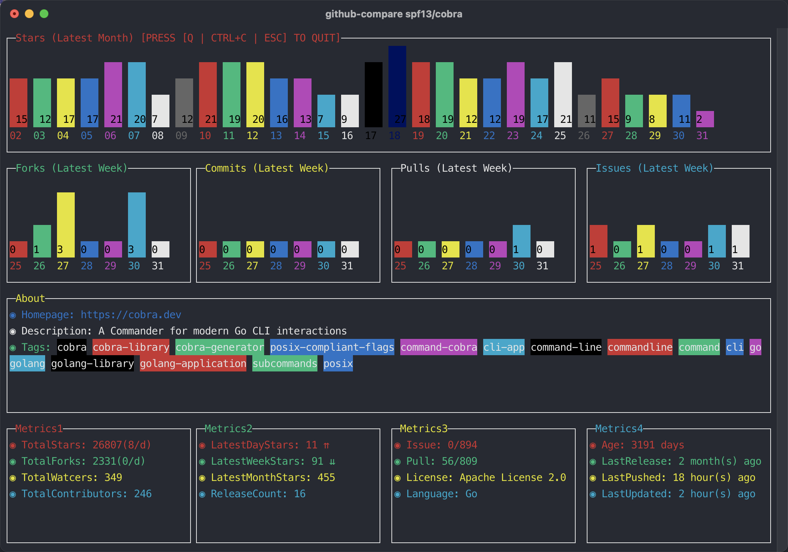
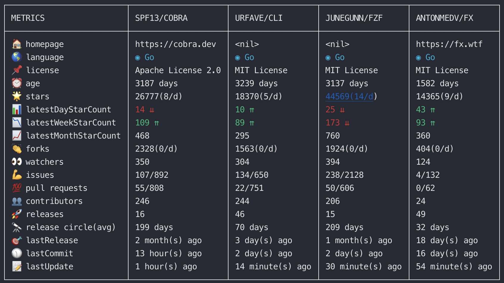
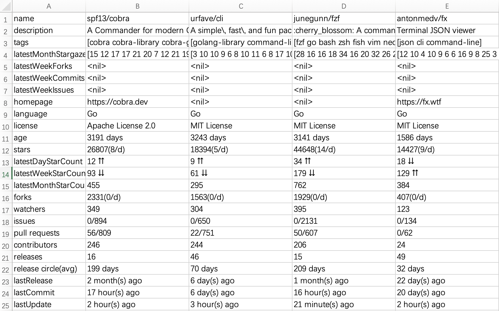

我们在做框架调研时，你可能会先通过 google 去搜索相关关键词得到一些结果，其次是从 GitHub 查看相应的 Topic 来选择合适的框架。相信大多数人
在选择框架时，不会随随便便就拿来用，而是查看一些该仓库的指标来决定是否选择，或者对多框架进行对比。

<!-- truncate -->

# 前言

我们知道，在社区目前已经有了一些网页的对比工具，如：查看 star 趋势图的 `star-history`，而在终端上目前没有选择到适合工具进行 GitHub 仓库的
数据查看，我们通常在查看一个仓库时，通常会查看以下一些指标来总和衡量其稳定与否？
- star 数量(stars)
- 更新频率(releases)
- 社区活跃度(contributors)
- issue 的解决周期(remain issues)
- 仓库创建时长(age)
- 组织(organization)

我们以选择 Golang 微服务框架为例子，来对比一下当前社区比较火的一些框架
- go-zero
- kratos
- go-micro
- kit

在没有工具前，我们可能会每个仓库依次从以上各指标去其仓库首页看一下相关数据，这会显得比较繁琐，如果需要落地成为一些对比数据，则更需要自己手动去
编写一个表格。

我们来看一下 [github-compare](https://github.com/anqiansong/github-compare) 的对比结果：


通过该图可以很清晰的看到 GitHub 仓库的各项指标，接下来我们来看一下该工具的使用。

# github-compare
定位为一个 GitHub 仓库对比工具

## 仓库地址
https://github.com/anqiansong/github-compare

## 安装

```bash
$ go install github.com/anqiansong/github-compare@latest
```

## 示例
### TermUI

#### 单仓库
```bash
$ github-compare spf13/cobra
```



#### 多仓库

```bash
$ github-compare spf13/cobra urfave/cli junegunn/fzf antonmedv/fx
```



### JSON视图

```bash
$ github-compare spf13/cobra --json                                           
[
  {
    "age": "3191 days",
    "avgReleasePeriod": "199 days",
    "contributorCount": "246",
    "forkCount": "2331(0/d)",
    "fullName": "spf13/cobra",
    "homepage": "https://cobra.dev",
    "issue": "0/893",
    "language": "Go",
    "lastPushedAt": "15 hour(s) ago",
    "latestReleaseAt": "2 month(s) ago",
    "lastUpdatedAt": "3 minute(s) ago",
    "latestDayStarCount": "13 ⇈",
    "latestMonthStarCount": "455",
    "latestWeekStarCount": "93 ⇊",
    "license": "Apache License 2.0",
    "pull": "56/809",
    "releaseCount": "16",
    "starCount": "26807(8/d)",
    "watcherCount": "349",
    "description": "A Commander for modern Go CLI interactions",
    ...
]
```

### YAML视图

```bash
$ github-compare spf13/cobra --yaml                                           
- age: 3191 days
  avgreleaseperiod: 199 days
  contributorcount: "246"
  forkcount: 2331(0/d)
  fullname: spf13/cobra
  homepage: https://cobra.dev
  issue: 0/893
  language: Go
  lastpushedat: 15 hour(s) ago
  latestreleaseat: 2 month(s) ago
  lastupdatedat: 7 minute(s) ago
  latestdaystarcount: 13 ⇈
  latestmonthstarcount: "455"
  latestweekstarcount: 93 ⇊
  license: Apache License 2.0
  pull: 56/809
  releasecount: "16"
  starcount: 26807(8/d)
  watchercount: "349"
  description: A Commander for modern Go CLI interactions
  ...
```

### Export as a csv file

```bash
$ github-compare spf13/cobra urfave/cli junegunn/fzf antonmedv/fx -f data.csv
```




## 用法

### 准备工作
1. 点击去 GitHub [创建个人 AccessToken](https://docs.github.com/en/authentication/keeping-your-account-and-data-secure/creating-a-personal-access-token)
2. 设置 AccessToken
    -  复制 AccessToken 并添加到环境变量
    -  或者你可以在执行 `github-compare` 指令时通过 `--token` 显式传入

### 执行命令

```bash
# 通过 --token 传入 AccessToken
# github-compare zeromicro/go-zero go-kratos/kratos asim/go-micro go-kit/kit --token ${accessToken}
#  或者添加到环境变量(推荐)
$ export GITHUB_ACCESS_TOKEN=${GITHUB_ACCESS_TOKEN}
$ github-compare zeromicro/go-zero go-kratos/kratos asim/go-micro go-kit/kit
```

## 指令

```bash
$ github-compare -h                                                    
A GitHub repositories statistics command-line tool for the terminal

Usage:
  github-compare [flags]

Flags:
  -f, --file string    output to a specified file
  -h, --help           help for github-compare
      --json           print with json style
  -t, --token string   github access token
      --ui             print with term ui style(default) (default true)
  -v, --version        version for github-compare
      --yaml           print with yaml style
```

## 说明

1. GitHub AccessToken 是必填项。
2. `github-compare` 接受 1 到 4 个仓库进行数据查询。
3. 如果你通过环境变量来设置 AccessToken, 环境变量的 key 必须为 `GITHUB_ACCESS_TOKEN`。

## 最后
如果该工具对你有用，可以给个 [](https://github.com/anqiansong/github-compare) 哦
